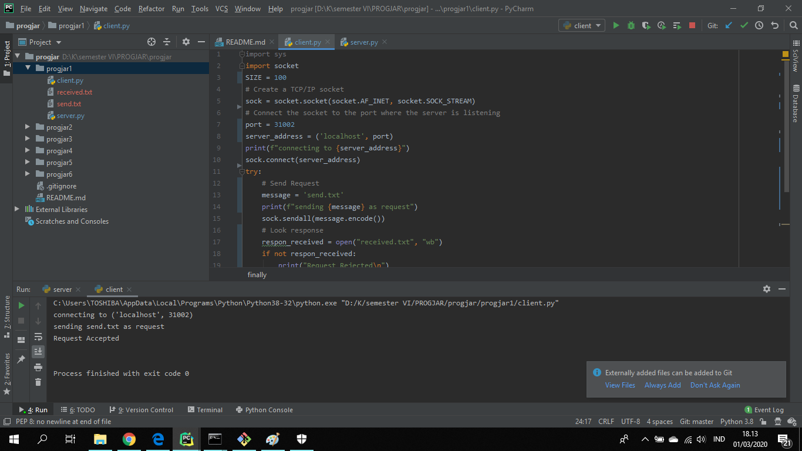

# Tugas 1

* Menjalankan client.py dan server.py dengan port 31000, 31001, dan 31002

* Mencoba mengirimkan file dari client ke server

* Client merequest file kepada server, kemudian server mengirimkan file tersebut

