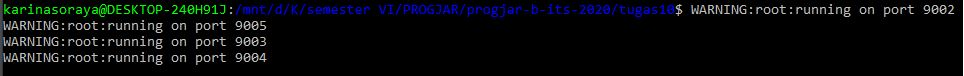
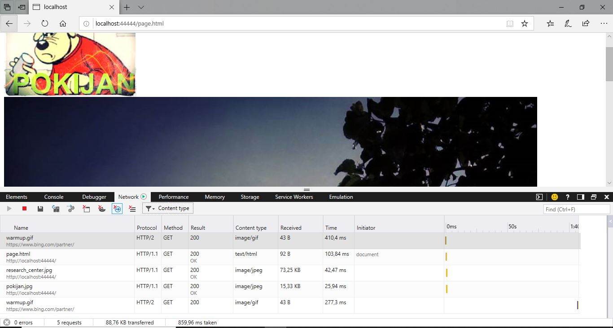
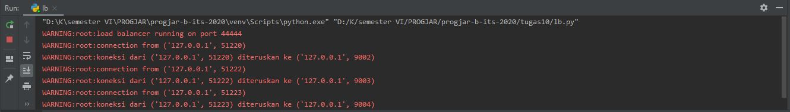
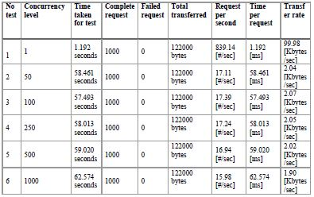
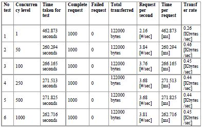
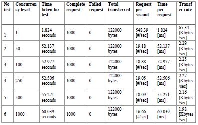

# Tugas 10
## Menjalankan Program
* Jalankan async_server.py pada port 9002, 9003, 9004, 9005 dengan cara menjalankan runserver.sh

* Jalankan lb.py pada port 44444
* Jalankan browser, akseslah http://localhost:44444/page.html

* Lihatlah di log program, bahwa setiap request akan dilayani oleh backend yang bergantian

#
## Tabel performance test dapat dilihat pada file 05111740000003_Tugas10.pdf atau pada lampiran berikut ini
* Asyncronus Server

* Multithread Server

* Asyncronus Server Dengan Load Balancer

