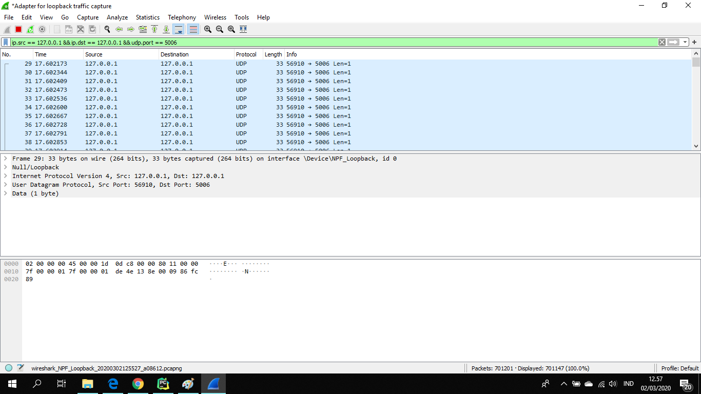

# Tugas 2

* Menjalankan udp_simple.py dari pc saya dengan ip 127.0.0.1 ke localhost dengan ip 127.0.0.1 menggunakan port 5006 , pesan yang dikirimkan berupa "KARINA SORAYA PUSPITASARI_05111740000003" sebagai berikut :

* Kemudian kita jalankan udp_fileclient.py dari pc saya dengan ip 127.0.0.1 ke localhost dengan ip 127.0.0.1 menggunakan port 5006 , pesan yang dikirimkan berupa scoob.png dan akan diterima sebagai terima.png sebagai berikut :

* Kita juga dapat menjalankan udp_simple.py dari pc saya dengan ip 10.151.253.21 ke pc lain dengan ip 10.151.252.191 , pesan yang dikirimkan berupa "KARINA SORAYA PUSPITASARI_05111740000003" sebagai berikut :

* Dan juga dapat menjalankan udp_fileclient.py dari pc saya dengan ip 10.151.253.21 ke pc lain dengan ip 10.151.252.191 , pesan yang dikirimkan berupa bart.png dan akan diterima sebagai coba.png sebagai berikut :

