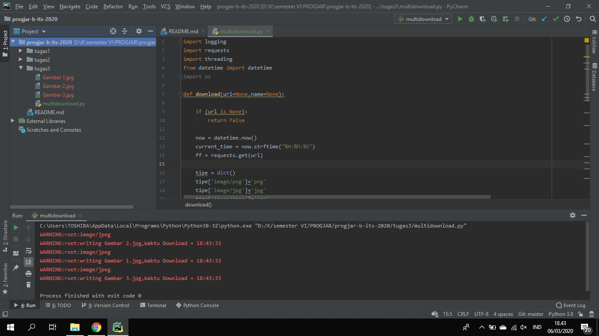

# Tugas 2

* Program untuk mendownload Gambar 1, Gambar 2, dan Gambar 3 berjalan bersamaan menggunakan multithreading sebagai berikut :

* Hasil download gambar 1

* Hasil download gambar 2

* Hasil download gambar 3

