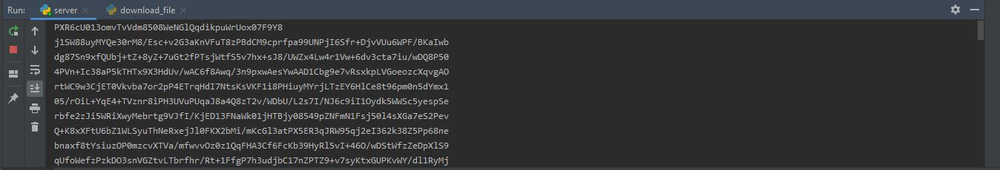
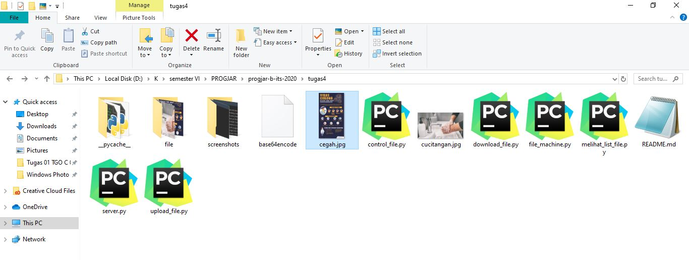

# Tugas Progjar 4
## Dokumentasi Protokol

#
## Membuat Server untuk menerima request dan merespon client 
* Pertama, jalankan server.py kemudian jalankan masing-masing client

#
## Mengupload File

* Upload file cucitangan.jpg dengan cara menjalankan upload_file.py sebagai berikut

* Maka file cucitangan.jpg akan terupload ke folder 'file' sebagai berikut

#
## Mendownload File
* Mendownload file karina.pdf dengan cara menjalankan download_file.py sebagai berikut

* Maka hasilnya sebagai berikut

#
## Melihat list file dalam folder 'file'
* Melihat list file dalam folder 'file' dalam format JSON dengan cara menjalankan melihat_list_file.py sebagai berikut

