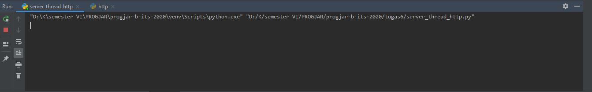

# Tugas 6
* Pertama-tama jalankan server_thread_http.py

* Lalu jalankan http.py

* Kemudian, bukalah chrome web browser dan aktifkan developer mode bagian network. Lalu bukalah alamat http://127.0.0.1:10001. Maka akan muncul tampilan sebagai berikut :

