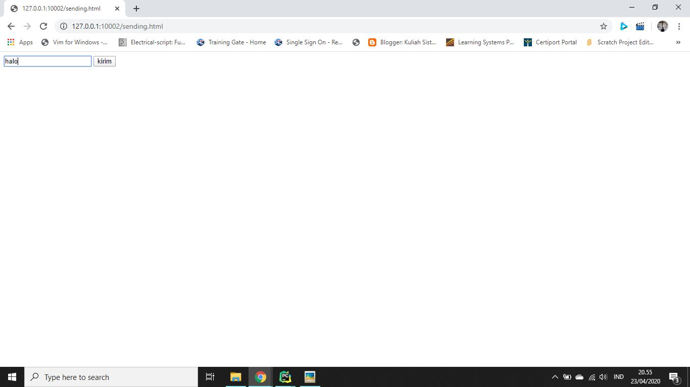
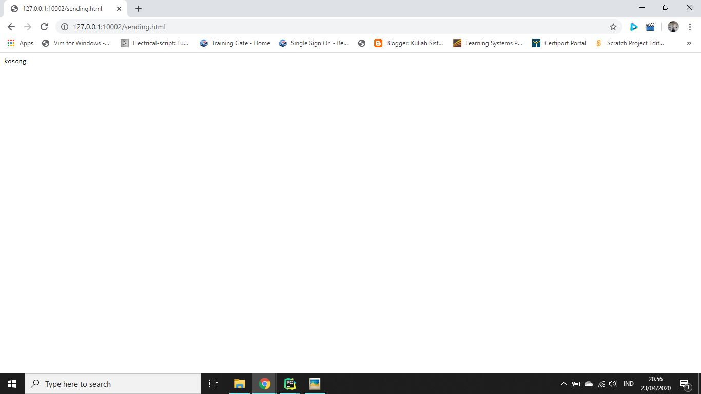
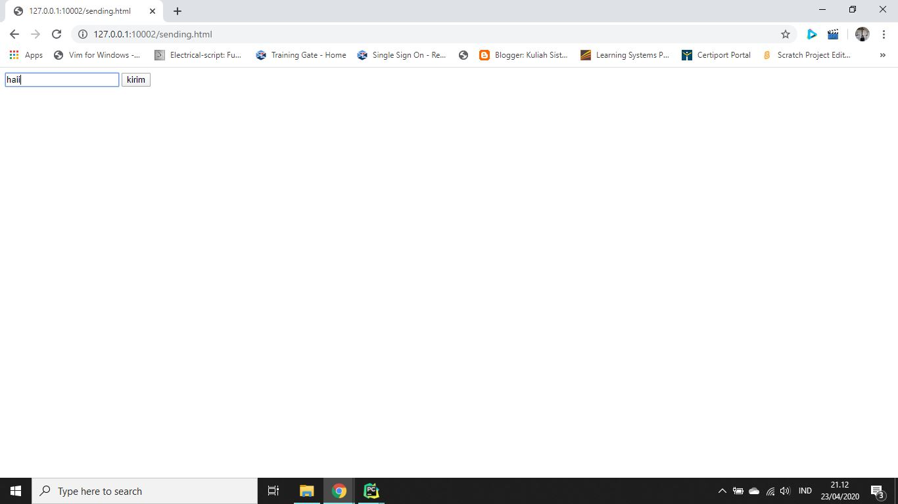
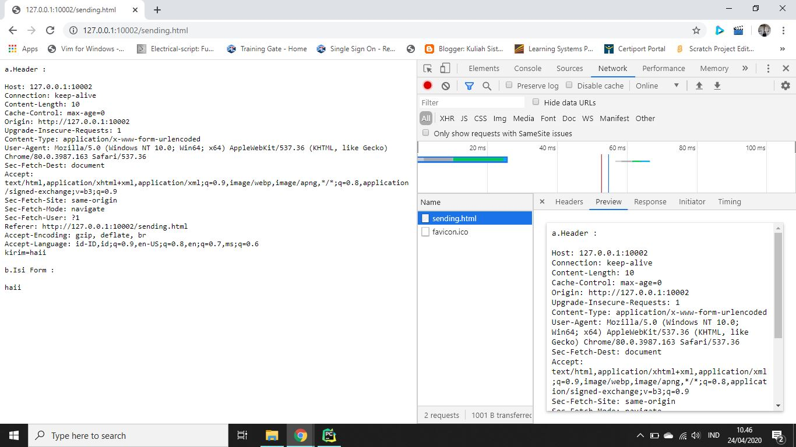

# Tugas 8

## Sebelum Modifikasi
Sebelum program dimodifikasi, saat kita membuka http://127.0.0.1:10002/sending.html dan mengisi sesuatu lalu mengirimnya, hasil atau output yang kita dapat adalah tulisan 'kosong' seperti berikut ini

#
## Sesudah Modifikasi
Sesudah program dimodifikasi, saat kita membuka http://127.0.0.1:10002/sending.html dan mengisi sesuatu lalu mengirimnya, hasil atau output yang kita dapat adalah semua header yang dikirim dari browser beserta sesuatu yang kita isikan sebelumnya (isi form) seperti berikut ini

